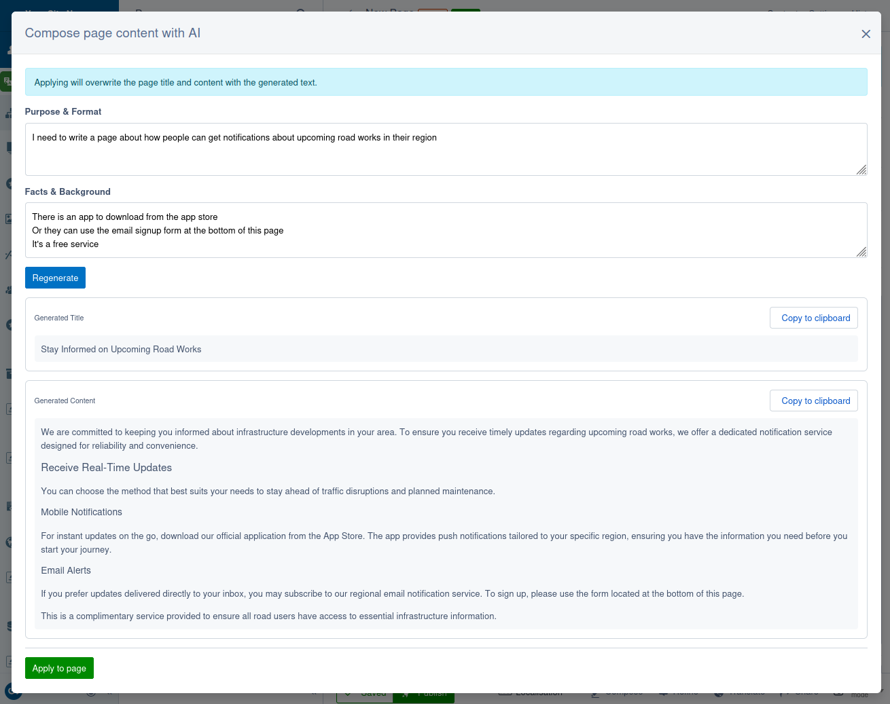

# AI compose module for Silverstripe CMS

AI-assisted page composition for Silverstripe CMS.

This module solves the editor "blank page" problem with a lightweight, on-demand workflow. Editors open a modal from the CMS page edit screen, provide a purpose and supporting facts, generate a draft title and body in one AI call, then preview, copy, or apply the result to Draft content. Generated results are cached only for the current CMS session and are never persisted to a module-owned table.



## Installation

This module is currently not listed on Packagist. To install it, add the following to your project's `composer.json`:

```json
{
    "repositories": [
        {
            "type": "vcs",
            "url": "git@github.com:silverstripeltd/silverstripe-ai-compose.git"
        }
    ],
    "require": {
        "silverstripeltd/ai-compose": "*"
    }
}
```

Then run `composer install` followed by `vendor/bin/sake dev/build flush=1` to register the module's routes, extensions, and config.

### Prerequisites

- Silverstripe CMS 6
- A saved page the current editor can edit
- A valid API key for one of the supported AI providers: Gemini, OpenAI, or Anthropic
- Optional: Elemental if pages should append a new content block instead of overwriting `Content`
- Optional: ai-refine if you want `SiteConfig.RefineDefinition` writing style and tone rules injected into prompts

## Usage

1. Save the page in the CMS so it has an ID.
2. Click the "Compose" button on the page edit form.
3. Enter one or both modal inputs:
   - `Purpose & Format` for the audience, style, and intent
   - `Facts & Background` for the source facts that must stay accurate
4. Click "Generate" to request a draft page title and HTML body.
5. Review the read-only preview, then either copy the output or apply it to the page.

### Draft apply behaviour

Compose always writes to `Draft` only. It never publishes content.

- Non-Elemental pages: applying overwrites `Title` and `Content`
- Elemental pages: applying overwrites `Title` and appends one new configured content block to the first `ElementalArea`

The module sanitises generated HTML server-side before any Draft write and strips all HTML from titles.

## Configuration

All configuration is via environment variables, for example in your webserver environment or `.env`. Restart the webserver after changing any values.

### Provider

Set the active AI provider and API key. Gemini, OpenAI, and Anthropic are supported out of the box. Custom providers can be added by extending `AbstractAIProvider` and overriding the factory via Injector.

```bash
AI_COMPOSE_PROVIDER=gemini                # gemini (default), openai, or anthropic
AI_COMPOSE_API_KEY=your-api-key           # API key for the chosen provider
```

### Model

Control which model is used and how it generates responses. All settings are optional and have sensible defaults.

```bash
AI_COMPOSE_MODEL=gemini-2.5-flash         # Model identifier (provider-specific)
AI_COMPOSE_THINKING_LEVEL=low             # Thinking effort for Gemini: none, low, medium, or high
AI_COMPOSE_TEMPERATURE=1.0                # Sampling temperature
AI_COMPOSE_MAX_TOKENS=4000                # Max tokens in AI response
AI_COMPOSE_REQUEST_TIMEOUT=30             # Timeout per AI request in seconds
```

Compose returns a full title plus page body, so longer pages may need `AI_COMPOSE_MAX_TOKENS` increased.

---

## Development

### AI tooling

AI tools should be run from the project root, not from within this directory. The module's `CLAUDE.md` should be symlinked to the project root so that AI tools pick it up automatically:

```bash
cd path/to/project

if [ -f CLAUDE.md ] || [ -L CLAUDE.md ]; then rm -f CLAUDE.md; fi
ln -s vendor/silverstripeltd/ai-compose/CLAUDE.md CLAUDE.md
```

`CLAUDE.md` contains project identity, hard constraints, directory structure, and module-specific command conventions.

### Running tests and linting

All commands use the same Docker-over-SSH style as the sibling AI modules.

- PHP unit tests:
  - `ssh webserver "cd /var/www && rm -rf /tmp/pu-cache && mkdir -p /tmp/pu-cache && SS_TEMP_PATH=/tmp/pu-cache nice -n 19 ionice -c 3 taskset -c 0 vendor/bin/phpunit vendor/silverstripeltd/ai-compose/tests/ --fail-on-warning"`
- JS prerequisite:
  - `ssh webserver "cd /var/www/vendor/silverstripe/admin && NODE_OPTIONS=--max-old-space-size=512 nice -n 19 ionice -c 3 taskset -c 0 yarn install"`
- Module JS install:
  - `ssh webserver "cd /var/www/vendor/silverstripeltd/ai-compose && NODE_OPTIONS=--max-old-space-size=512 nice -n 19 ionice -c 3 taskset -c 0 yarn install"`
- JS tests:
  - `ssh webserver "cd /var/www/vendor/silverstripeltd/ai-compose && NODE_OPTIONS=--max-old-space-size=512 nice -n 19 ionice -c 3 taskset -c 0 yarn test"`
- PHP linting:
  - `ssh webserver "cd /var/www/vendor/silverstripeltd/ai-compose && nice -n 19 ionice -c 3 taskset -c 0 ../../bin/phpcs --ignore=*/thirdparty/*,*/node_modules/* --extensions=php ."`
- JS and SCSS linting:
  - `ssh webserver "cd /var/www/vendor/silverstripeltd/ai-compose && NODE_OPTIONS=--max-old-space-size=512 nice -n 19 ionice -c 3 taskset -c 0 yarn lint"`

### Technical details

See `specs/` for the detailed architecture, prompt, provider, API, and CMS UX specifications.
